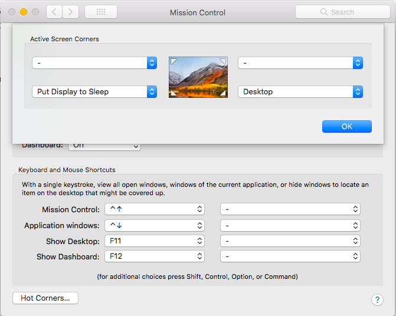
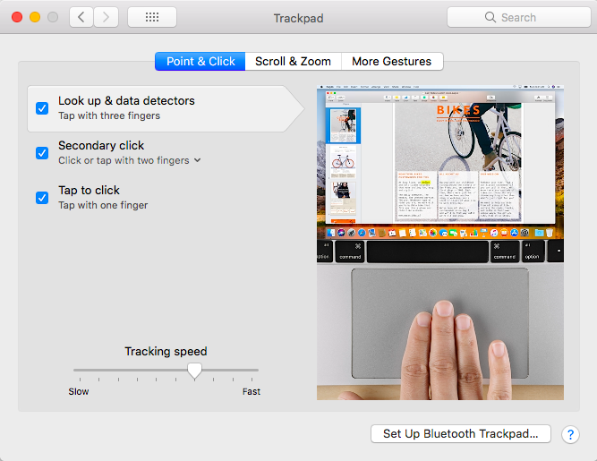
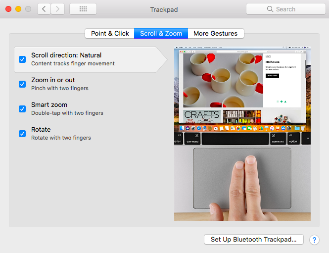
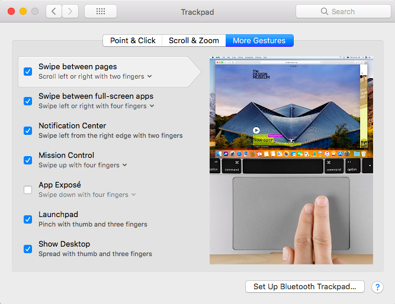

# mac-setup
Mac Apps, Tools and Configs 💻 ⚒

## Table of Contents

- [Apps](#Apps)
- [Terminal](#Terminal)
- [Config](#Config)

## Apps

👨‍💻 Apps in my Macbook. I prefer native apps, open source.

### [Android Studio](https://developer.android.com/studio/index.html)

- The Official IDE for Android

### [Caprine](https://sindresorhus.com/caprine/)

- Elegant Facebook Messenger desktop app

### [Charles](https://www.charlesproxy.com/)

- Web Debugging proxy application

### [Gitify](https://www.gitify.io/)

- Github notifications on Desktop

### [Gitscout](https://gitscout.com/)

- A beautiful and optimized GitHub Issues experience for macOS

### [Google Chrome]()

- One fast, simple, and secure browser for all your devices
- Extensions:
  - [Authenticator](https://chrome.google.com/webstore/detail/authenticator/bhghoamapcdpbohphigoooaddinpkbai?hl=en-US): For Google Authenticator and Battle.net Authenticator.
  - [GitHub File Icon](https://chrome.google.com/webstore/detail/github-file-icon/ficfmibkjjnpogdcfhfokmihanoldbfe?hl=en-US): A Chrome Extension which energizes GitHub file system.
  - [GitHub Repository Size](https://chrome.google.com/webstore/detail/github-repository-size/apnjnioapinblneaedefcnopcjepgkci?hl=en-US): Automatically adds repository size to GitHub's repository summary
  - [Google Dictionary (by Google)](https://chrome.google.com/webstore/detail/google-dictionary-by-goog/mgijmajocgfcbeboacabfgobmjgjcoja?hl=en-US): View definitions easily as you browse the web.
  - [Isometric Contributions](https://chrome.google.com/webstore/detail/isometric-contributions/mjoedlfflcchnleknnceiplgaeoegien?hl=en-US): Renders an isometric pixel view of GitHub contribution graphs.
  - [Octotree](https://chrome.google.com/webstore/detail/octotree/bkhaagjahfmjljalopjnoealnfndnagc?hl=en-US): Code tree for GitHub
  - [Quick-Notifier for ChatWork](https://chrome.google.com/webstore/detail/quick-notifier-for-chatwo/iefjfellkjkdgblkddcopacjclijfjik?hl=en-US): Quick-Notifier for ChatWork is an extension for quickly announcing your notifications on ChatWork.
  - [Refined GitHub](https://chrome.google.com/webstore/detail/refined-github/hlepfoohegkhhmjieoechaddaejaokhf?hl=en-US): Simplifies the GitHub interface and adds useful features
  - [ZenHub for GitHub](https://chrome.google.com/webstore/detail/zenhub-for-github/ogcgkffhplmphkaahpmffcafajaocjbd?hl=en-US): ZenHub – Project Management Inside GitHub

### [IntelliJ IDEA CE](https://www.jetbrains.com/idea/)

- The Java IDE for Professional Developers by JetBrains

### [Itsycal](https://www.mowglii.com/itsycal/)

- Itsycal is a tiny menu bar calendar

### [Postman](https://www.getpostman.com/)

- Postman is the complete toolchain for API developers

### [Slack](https://slack.com/)

- Rally your coworkers with messaging, calls, files and your favorite apps in one place

### [Sourcetree](https://www.sourcetreeapp.com/)

- Simplicity and power in a beautiful Git GUI

### [Spotify](https://www.spotify.com/)

- Music for everyone

### [TablePlus](https://tableplus.io/)

- Modern, native, and friendly tool for relational databases

### [Telegram](https://telegram.org/)

- A new era of messaging

### [TunnelBear](https://www.tunnelbear.com/download)

- Simple, private, free access to the open Internet

### [Typora](https://typora.io/)

- A markdown editor, markdown reader

### [Visual Studio Code](https://code.visualstudio.com/)

- Code Editing. Redefined

### [Xcode](https://developer.apple.com/xcode/)

- Xcode includes everything you need to create amazing apps for iPhone, iPad, Mac, Apple Watch, and Apple TV.

### [Zeplin](https://zeplin.io/)

- Build pixel perfect apps in peace

## Terminal

💻💻 Tools for Terminal

### [brew](https://brew.sh/)

- The missing package manager for macOS

### [bundler](http://bundler.io/)

- The best way to manage a Ruby application's gems

### [oh-my-zsh](http://ohmyz.sh/)

- Oh-My-Zsh is an open source, community-driven framework for managing your ZSH configuration. It comes bundled with a ton of helpful functions, helpers, plugins, themes...

### [nvm](https://github.com/creationix/nvm)

- `Node` Version Manager - Simple bash script to manage multiple active node.js versions

### Language Version Management

- #### [rbenv](https://github.com/rbenv/rbenv)

  - Groom your app’s `Ruby` environment.

- #### [pyenv](https://github.com/pyenv/pyenv)

  - Simple `Python` version management

- #### [goenv](https://github.com/syndbg/goenv)

  - Like rbenv and pyenv, but for `Go`.

## Config

### System Preferences ⚙️

#### Desktop & Screen Saver

- Using `Word of the Day` to study vocabulary everyday :smile:

#### Mission Control

- Add two `Hot Corners`

#### Security & Privacy

- Choose `App Store and identified developers` in **General** tab.

#### Build-in Display

- Config `Night Shift` in **Night Shift** tab

#### Keyboard

- **Keyboard**:
  - Key Repeat: Fast
  - Delay Until Repeat: Fast
- **Shortcuts**:
  - Input Sources: Tick `Select the previous input source` with `⌃Z` (Control+Z)

#### Trackpad

- Point & Click:

  

- Scroll & Zoom:

  

- More Gestures:

#### Accessibility

- Mouse & Trackpad:

  - Trackpad Options: 

    